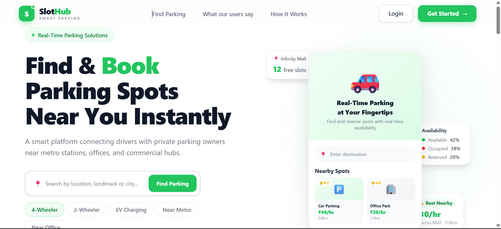
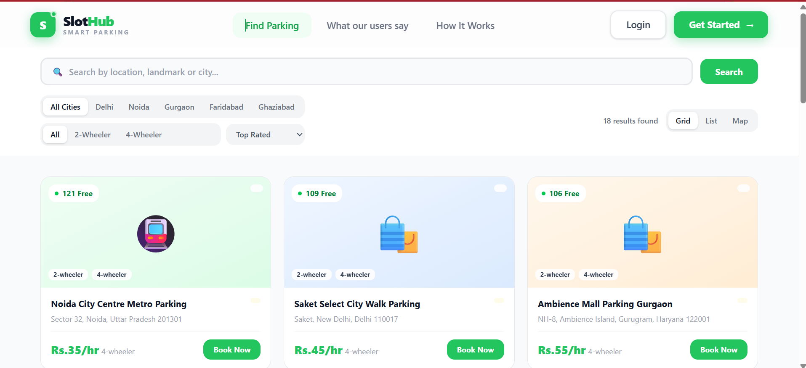
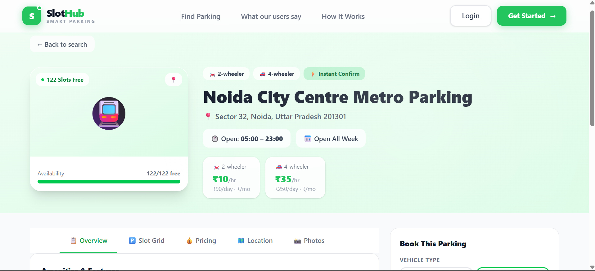
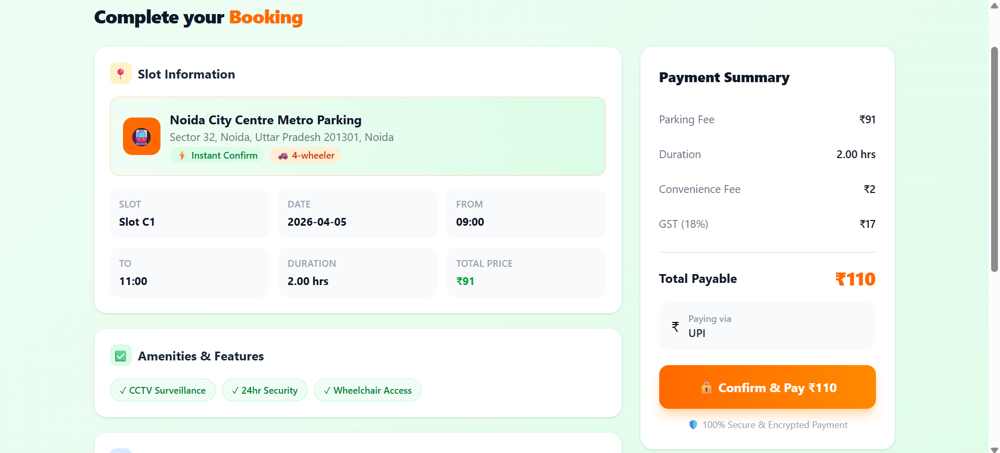
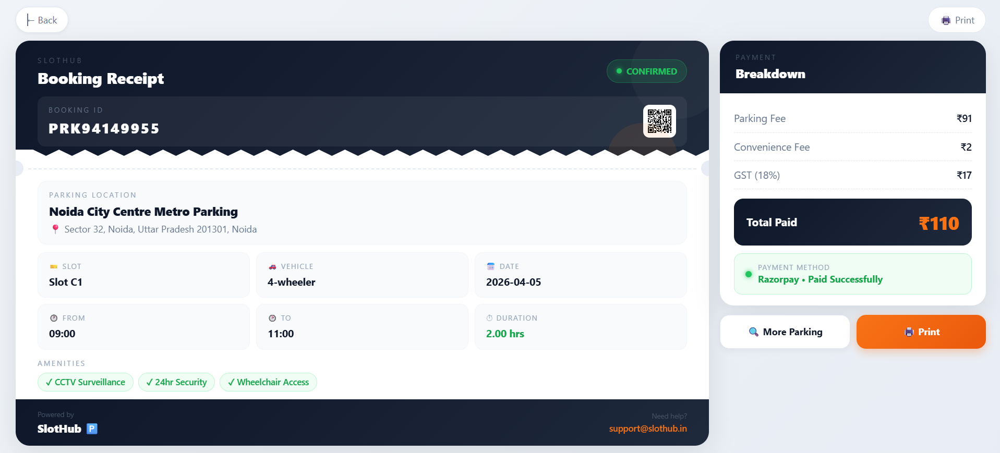
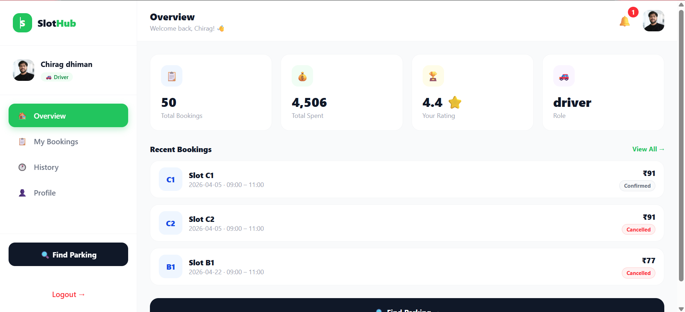
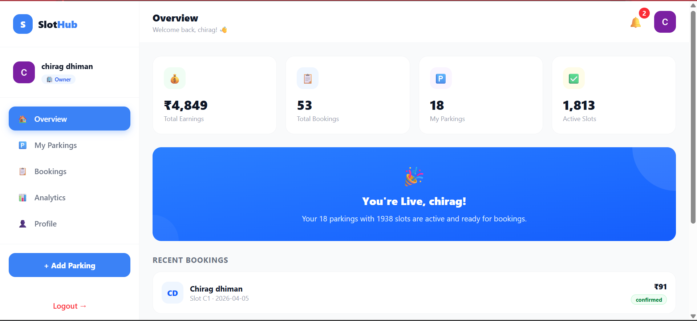
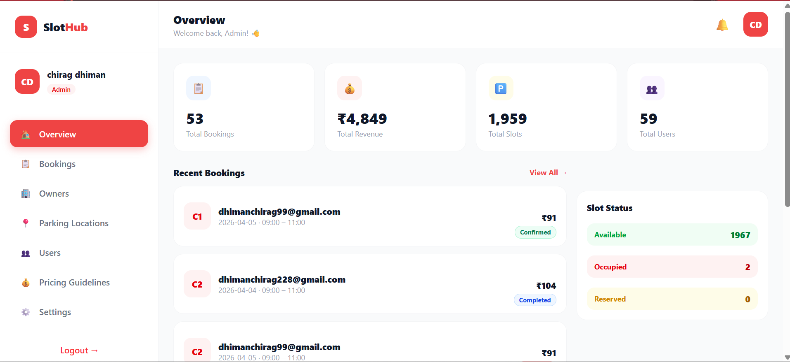

<div align="center">


<br/><br/>

```
 ___  _       _     _   _       _     
/ __|| |  ___| |_  | | | |_   _| |__  
\__ \| | / _ \ __| | |_| | | | | '_ \ 
|___/|_| \___/\__|  \___/|_|_|_|_.__/ 
```

# 🅿️ SlotHub — Smart Parking System

### *Find. Book. Park. Repeat.*

A production-ready, full-stack smart parking platform that solves real urban parking problems.  
Multi-role system | Real-time availability | Google OAuth | Razorpay Payments | Interactive Maps

<br/>

[](https://smart-parking-system-frontend-kappa.vercel.app)
[](https://smart-parking-system-backend-oco6.onrender.com)

</div>

---
live demo -> https://smart-parking-system-frontend-kappa.vercel.app/

## 💡 Why I Built This

Living in Dharamsala, I've seen how chaotic parking gets during tourist season — cars circling for 30 minutes, private lots sitting empty right next to overcrowded streets. I built SlotHub to fix exactly that — connecting people who need parking with people who have unused space, with real-time booking and smart time-based slot management so every slot gets maximum utilization throughout the day.

---

## 🧠 The Real Problem I Solved

Beyond the obvious, I solved a critical real-world edge case that most parking systems get wrong:

### ⚡ Time-Based Slot Conflict Resolution

> **The Problem:** Parking slot C1 is booked from 10am–12pm. Can someone else book C1 from 1pm–3pm? Most naive systems block the entire slot for the whole day.

**My Solution:** Bookings are validated against **time ranges, not just dates.** A slot can be booked multiple times per day by different users — as long as their time windows don't overlap.

```
Slot C1 — April 4, 2026
├── Booking 1: 10:00 AM → 12:00 PM  ✅ Confirmed
├── Booking 2: 01:00 PM → 03:00 PM  ✅ Confirmed (different window)
└── Booking 3: 11:00 AM → 02:00 PM  ❌ Rejected (overlaps with both)
```

This dramatically improves slot utilization — a single parking slot can serve **multiple users per day** instead of being locked for one booking.

---

## 📸 Screenshots

### 🏠 Landing Page
<!-- Add screenshot: Full landing page hero section -->


---

### 🔍 Search & Map View
<!-- Add screenshot: Search page with map and parking markers -->


---

### 🅿️ Parking Detail
<!-- Add screenshot: Parking detail page with map, slots, pricing -->


---

### 💳 Payment Page
<!-- Add screenshot: Razorpay checkout page -->


---

### 📄 Booking Receipt
<!-- Add screenshot: PDF receipt page with download button -->


---

### 👤 Driver Dashboard
<!-- Add screenshot: Driver dashboard with booking history -->


---

### 🏢 Owner Dashboard
<!-- Add screenshot: Owner dashboard with analytics and charts -->


---

### 🛡️ Admin Dashboard
<!-- Add screenshot: Admin dashboard with stats, charts, user management -->


---

## 🏗️ Three-Role Architecture

```
SlotHub Platform
│
├── 👤 DRIVER
│   ├── Register / Login (Email + Google OAuth)
│   ├── Search parking by location
│   ├── View slots on interactive map (Leaflet.js)
│   ├── Filter by date, time & vehicle type
│   ├── View parking details (address, pricing, availability)
│   ├── Book slot → Razorpay payment
│   ├── Booking processing & confirmation screen
│   ├── Booking success page with summary
│   ├── Download PDF booking receipt
│   ├── Receive email confirmation (Nodemailer)
│   └── View full booking history with status tracking
│
├── 🏢 OWNER
│   ├── Register / Login (Email + Google OAuth)
│   ├── Add & manage parking locations
│   ├── Set number of slots, pricing & vehicle types
│   ├── View all bookings for their locations
│   ├── Revenue analytics with charts
│   ├── Booking trends visualization (Recharts)
│   └── Manage profile & account settings
│
└── 🛡️ ADMIN
    ├── Secure login (separate protected route)
    ├── View all users, owners & bookings
    ├── Monitor total platform revenue
    ├── Manage all parking locations
    ├── Real-time booking trends (LineChart)
    ├── Revenue trends (BarChart)
    ├── Slot status overview (Available / Occupied / Reserved)
    └── Animated stats with CountUp (bookings, revenue, slots, users)
```

---

## ✨ Features

### 🔐 Authentication & Security
- Email/password signup & login with JWT (7-day expiry)
- Google OAuth 2.0 via Passport.js — one-click login
- Role-based access: `driver`, `owner`, `admin`
- Protected routes — unauthorized users redirected automatically
- Admin route extra-protected via `ProtectedAdminRoute` component
- Rate limiting on admin login to prevent brute force attacks
- Passwords hashed with bcryptjs

### 🅿️ Parking & Booking
- Search parking locations by area/city
- Interactive map with Leaflet.js showing parking markers
- Time-based slot availability — slots bookable multiple times per day
- Real-time conflict detection on booking
- Full booking lifecycle: Processing → Success → Receipt
- Booking status tracking: `pending`, `confirmed`, `active`, `completed`, `cancelled`
- PDF receipt generation with react-to-pdf

### 💳 Payments
- Razorpay payment gateway integration
- Order created on backend, verified on success
- Payment success triggers booking confirmation
- Email receipt sent automatically via Nodemailer

### 📊 Dashboards
- **Driver Dashboard** — booking history, status badges, slot info
- **Owner Dashboard** — listings management, revenue analytics, booking trends
- **Admin Dashboard** — platform-wide stats, charts, user & booking management

### 🎨 UI & UX
- Fully responsive — mobile, tablet & desktop
- Framer Motion animations throughout
- React Hot Toast notifications
- Animated number counters (react-countup) on stats
- Custom tooltips on Recharts
- Loading spinners & Suspense fallbacks
- Clean status badges with color coding per booking state

---

## 🛠️ Tech Stack

### Frontend
| Library | Purpose |
|---|---|
| React 18 | UI Framework |
| Vite 7.3 | Build tool & dev server |
| Tailwind CSS 3 | Utility-first styling |
| React Router v6 | Client-side routing |
| Framer Motion | Animations & transitions |
| Axios | HTTP client |
| Recharts | Data visualization (Line + Bar charts) |
| Leaflet.js + React-Leaflet | Interactive maps |
| react-to-pdf | PDF receipt generation |
| React Hot Toast | Notifications |
| Lucide React | Icons |
| react-countup | Animated number counters |
| JWT Decode | Token parsing |

### Backend *(separate repo)*
| Library | Purpose |
|---|---|
| Node.js + Express | Server |
| MongoDB + Mongoose | Database |
| Passport.js | Google OAuth 2.0 |
| Razorpay | Payment gateway |
| Nodemailer | Email confirmations |
| bcryptjs | Password hashing |
| jsonwebtoken | JWT auth |
| express-rate-limit | Brute force protection |

---

## ⚡ Performance

Every route is lazy loaded using `React.lazy()` + `Suspense`. Heavy vendor libraries are split into separate cached chunks using Vite's `manualChunks` config.

Initial page load is ~400KB instead of 2MB+ — users only download what they need, when they need it. Vendor chunks like charts and maps load only when the user navigates to those pages.

---

## 🔐 Auth Flow

```
User → "Continue with Google"
     → Backend /api/auth/google
     → Google OAuth consent screen
     → Backend /api/auth/google/callback
     → JWT generated (role embedded, 7d expiry)
     → Redirect to /{role}/dashboard?token=...
     → Token stored in localStorage
```

---

## 💳 Payment Flow

```
User selects slot + time window
     → Amount calculated on frontend
     → Razorpay order created via backend
     → Razorpay checkout UI opens
     → Payment success
     → Booking saved to DB
     → Email confirmation sent via Nodemailer
     → PDF receipt available for download
```

---

## 📁 Project Structure

```
src/
├── pages/
│   ├── Landing.jsx             ← Home page
│   ├── Search.jsx              ← Search parking by location
│   ├── ParkingDetail.jsx       ← Slot detail + Leaflet map
│   ├── Payment.jsx             ← Razorpay checkout
│   ├── Howitworks.jsx          ← Info page
│   ├── Reviewssection.jsx      ← User reviews
│   ├── NotFound.jsx            ← 404 page
│   ├── auth/
│   │   ├── Login.jsx
│   │   ├── Register.jsx
│   │   ├── adminlogin.jsx
│   │   └── protectedadminroute.jsx
│   └── booking/
│       ├── Bookingprocessing.jsx
│       ├── Bookingsuccess.jsx
│       └── Bookingreciept.jsx
│
├── dashboard/
│   ├── driver/DriverDashboard.jsx
│   ├── owner/
│   │   ├── ownerdashboard.jsx
│   │   └── components/OwnerAnalyticsAndProfile.jsx
│   └── admin/
│       ├── admindashboard.jsx
│       └── components/AdminOverview.jsx
│
├── App.jsx         ← All routes with React.lazy + Suspense
└── main.jsx        ← Entry point
```

---

## 🌐 Deployment

| Layer | Platform | URL |
|---|---|---|
| Frontend | Vercel | [smart-parking-system-frontend-kappa.vercel.app](https://smart-parking-system-frontend-kappa.vercel.app) |
| Backend | Render | [smart-parking-system-backend-oco6.onrender.com](https://smart-parking-system-backend-oco6.onrender.com) |
| Database | MongoDB Atlas | Cloud hosted |

---

## 🚀 Run Locally

```bash
git clone https://github.com/chiragdhiman99/smart-parking-system-frontend
cd smart-parking-system-frontend
npm install
npm run dev
```

---

## 📬 Contact

**Chirag Dhiman**  
📧 dhimanchirag99@gmail.com  
🔗 [GitHub](https://github.com/chiragdhiman99)

---

<div align="center">


</div>
